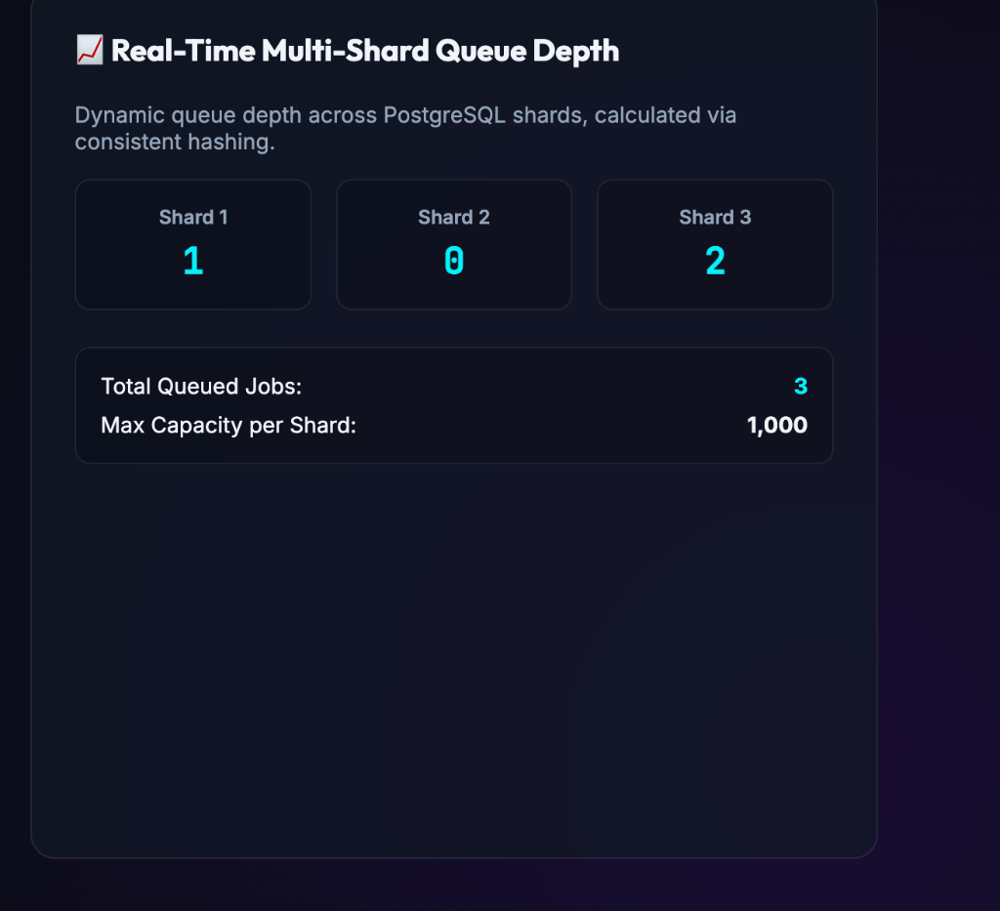
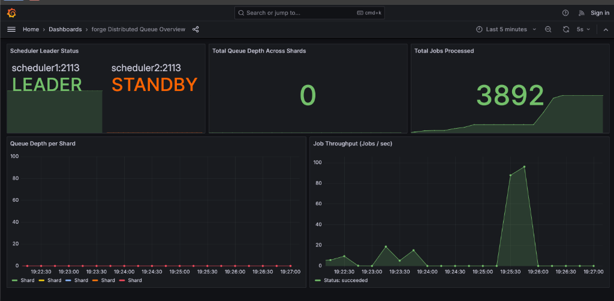
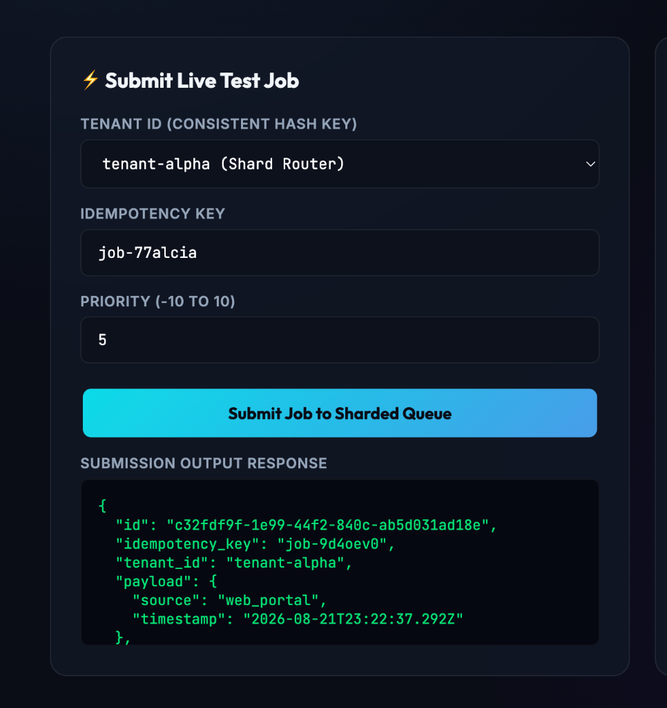
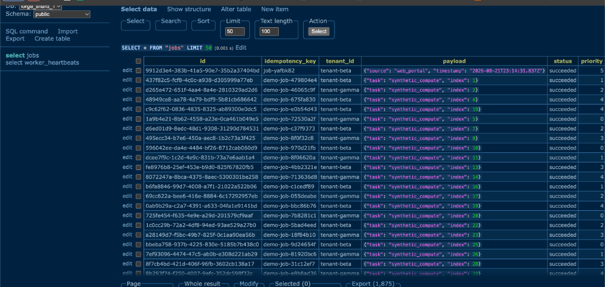

# `forge` — Distributed Task Queue & Multi-Database Sharded Scheduler

`forge` is a high-performance, fault-tolerant distributed job scheduling and execution engine built with **Go**, **etcd**, **PostgreSQL**, and **Python (FastAPI + Client SDK)**.

It features **etcd Raft leader election**, **active leadership re-validation to prevent split-brain traps**, **atomic database job claiming (`FOR UPDATE SKIP LOCKED`)**, **Multi-Database Consistent Hash Ring Sharding (256 virtual nodes)**, **dedicated worker shard pools**, **auto-provisioned Grafana dashboards**, and **parallel multi-shard dead-worker reaping**.

---

## 🌐 Live Deployed Public Stack (Oracle Cloud Infrastructure)

- ⚡ **Main Interactive Control Portal**: [`http://150.136.216.103:8000/`](http://150.136.216.103:8000/) *(Single-click hub with live job submission & real-time queue depth)*
- 📊 **Live Grafana Metrics Dashboard**: [`http://150.136.216.103:3000`](http://150.136.216.103:3000) *(Anonymous Read-Only Access)*
- 📖 **Interactive Swagger API & Docs**: [`http://150.136.216.103:8000/docs`](http://150.136.216.103:8000/docs)
- 🗄️ **Adminer Database Web GUI**: [`http://150.136.216.103:8080`](http://150.136.216.103:8080) *(Connect to `postgres_shard_1`, `postgres_shard_2`, `postgres_shard_3`)*

---

## 🖼️ Visual System Tour

### 1. Live Job Submission & Consistent Hash Routing
Submit multi-tenant tasks directly from the web browser. The in-process router hashes `tenant_id` across 256 virtual nodes and assigns the task to a specific PostgreSQL shard (`shard-1`, `shard-2`, `shard-3`).



### 2. Real-Time Multi-Shard Queue Depth Monitoring
Dynamic queue depth calculated across database shards. Updates automatically every 2 seconds.



### 3. Live Grafana Metrics & Active Leader Status
Live tracking of total jobs processed (**3,892+ jobs**), throughput per second (~100 jobs/sec), and active etcd Raft scheduler leader status.



### 4. Multi-Database Sharded Storage (Adminer Web GUI)
Direct SQL inspection of partitioned PostgreSQL tables showing `tenant_id`, `idempotency_key`, `status` (`succeeded`), and assigned `worker_id`.



---

## 🧭 Step-by-Step Live User Testing Guide

Follow these steps to manually test and explore the live system end-to-end:

### Step 1: Open the Control Portal
Navigate to [`http://150.136.216.103:8000/`](http://150.136.216.103:8000/).

### Step 2: Submit Live Jobs & Test Shard Router
1. Under **Submit Live Test Job**, select **`tenant-alpha`**.
2. Click **Submit Job to Sharded Queue**.
3. Observe the output JSON returning `shard-3` (`postgres_shard_3`).
4. Now select **`tenant-beta`** and submit—observe how consistent hashing routes it to `shard-1` (`postgres_shard_1`)!

### Step 3: Run High-Throughput Load Traffic
To stream high-volume job traffic into the system, run our multi-threaded workload generator from your terminal:

```bash
# Submit 3,000 synthetic jobs in rapid parallel stream to the live cloud cluster
python scripts/mass_load.py --url http://150.136.216.103:8000 --count 3000 --concurrency 50
```

### Step 4: Watch Live Metrics on Grafana
Open [`http://150.136.216.103:3000`](http://150.136.216.103:3000) to see the throughput chart spike to ~100 jobs/sec and watch the **Total Jobs Processed** counter increment in real-time.

### Step 5: Inspect Sharded SQL Databases
Open [`http://150.136.216.103:8080`](http://150.136.216.103:8080):
- **System**: `PostgreSQL`
- **Server**: `postgres_shard_1` *(or `postgres_shard_2`, `postgres_shard_3`)*
- **Username**: `postgres`
- **Password**: `postgrespassword`
- **Database**: `forge_shard_1`
- Click **`select jobs`** on the left menu to view thousands of raw stored records across shards!

---

## 📦 Pip-Installable Client SDK (`forge-sdk`)

Install directly from GitHub:
```bash
pip install "git+https://github.com/vraj2131/Quorum-Queue.git#subdirectory=sdk"
```

**Python Usage Example**:
```python
from forge_sdk import ForgeClient

# Connect to deployed cloud API
client = ForgeClient(base_url="http://150.136.216.103:8000")

# Submit job to specific tenant shard
job = client.submit_job(
    idempotency_key="order-task-101",
    tenant_id="tenant-alpha",
    payload={"type": "compute", "duration": "100ms"},
    priority=5,
)
print(f"Submitted Job ID: {job.id} on Shard: {job.shard_id}")

# Inspect total and per-shard queue depth
depth = client.get_queue_depth()
print("Per-Shard Queue Depth:", depth.per_shard)

# Wait for completion
completed_job = client.wait_for_job(job.id, timeout=10.0)
print(f"Final Job Status: {completed_job.status}")
```

---

## 🏗️ System Architecture

```
                      ┌─────────────────────────────────┐
                      │    Python SDK / Python API      │
                      │ (FastAPI In-Process Hash Router)│
                      └─────────────────────────────────┘
                                       │
                Reads Live Shard Map   │ Resolves Shard via
                & Watches etcd Updates │ Consistent Hashing (256 vnodes)
                                       ▼
                      ┌─────────────────────────────────┐
                      │      etcd 3-Node Cluster        │
                      │  (/forge/shards, /forge/leader, │
                      │   /forge/workers/{shard_id})    │
                      └─────────────────────────────────┘
                             ▲                   ▲
             Polls Assigned  │                   │ Parallel Reaper Scans
                Shard DB     │                   │ (Active Leader Only)
                             │                   │
         ┌───────────────────┴───┐           ┌───┴────────────────────┐
         │ Worker Pool Node      │           │ Scheduler Leader Node  │
         │ (Shard-Dedicated Pools│           │ (Parallel Multi-Shard) │
         └───────────────────────┘           └────────────────────────┘
                   │       │                             │       │
      FOR UPDATE   │       │ FOR UPDATE      FOR UPDATE  │       │ FOR UPDATE
     SKIP LOCKED   │       │ SKIP LOCKED    SKIP LOCKED  │       │ SKIP LOCKED
                   ▼       ▼                             ▼       ▼
           ┌──────────────┐ ┌──────────────┐     ┌──────────────┐ ┌──────────────┐
           │ Postgres DB  │ │ Postgres DB  │ ... │ Postgres DB  │ │ Postgres DB  │
           │   Shard 1    │ │   Shard 2    │     │   Shard N-1  │ │   Shard N    │
           └──────────────┘ └──────────────┘     └──────────────┘ └──────────────┘
```

---

## 🔑 Core Distributed Systems Mechanisms

### 1. Multi-Database Consistent Hash Ring Sharding
- **Consistent Hash Router**: Implemented in Go (`shared/router/hash_ring.go`) and Python (`api/app/router.py`) using 256 virtual nodes per physical shard.
- **Tenant Partitioning**: Jobs are partitioned deterministically across database shards by `tenant_id`, guaranteeing uniform load distribution without single-database bottlenecks.

### 2. Dedicated Shard Worker Pools
- Worker nodes register for dedicated database shards via `etcd` leases and configuration (`ASSIGNED_SHARDS="shard-1,shard-2"`).
- Each worker instance manages isolated database connection pools and goroutine pools per shard to eliminate cross-shard lock contention.

### 3. etcd Leader Election & Active Re-Validation
- Scheduler instances compete for leadership using `go.etcd.io/etcd/client/v3/concurrency`.
- **Split-Brain Protection**: Before performing any reaper or dispatch operation, the scheduler actively re-validates its leadership against etcd.

### 4. Parallel Multi-Shard Dead-Worker Reaper
- The active Scheduler Leader reads the active shard topology from etcd and spawns parallel background goroutines across all database shards.
- Expired worker jobs (`last_heartbeat < now() - 10s`) are automatically requeued or transitioned to `failed` when `max_attempts` is reached.

---

## 🚀 Quickstart & One-Command Deploy

### Full Production Stack (with Grafana, Prometheus, Adminer, Caddy)
```bash
docker compose -f deploy/docker-compose.prod.yml up -d
```

### Multi-Database Sharded Cluster
```bash
docker compose -f deploy/docker-compose.sharded.yml up --build
```

---

## 📊 Running Tests

### Go Test Suite (with Race Detector & Shard Routing Tests)
```bash
go test -v -race ./shared/... ./worker/... ./scheduler/...
```

### Python API & SDK Test Suite
```bash
pytest -v api/tests/ sdk/tests/
```
